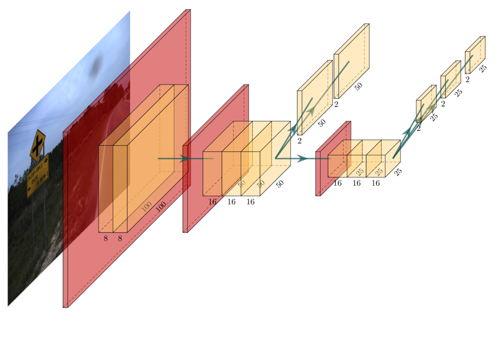
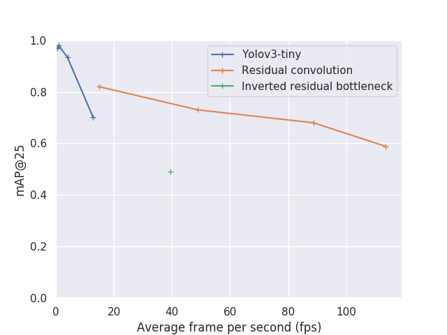

# Real time detection of traffic signs on mobile device

Code for my master thesis at Georgia Tech in Fall 2019.

The goal was to create a neural network capable of running traffic sign detection
in real time on a mobile device, using as few computation as possible to be able
to run on old devices, save power or run other process at the same time.

To achieve this task we reduced the accuracy of the bounding boxes predicted,
to make the task either. This explaining why we use mAP@25 here, you can see the
same graph for mAP@50 in the [graph directory](./graphs), or take a look to the reports
for more information. 

(Thanks to https://github.com/HarisIqbal88/PlotNeuralNet for this wonderful library which
allowed me to produce this representation)

## Reports

My thesis dissertation is available [here](reports/dissertation/thesis.pdf)
as well as my [presentation slides](reports/presentation/presentation_1.pdf).

## Code

### Requirement

Tested with python3.6 under Ubuntu 18.04, should work with newer, older version.

Python library requirements are given in [requirement.txt](./requirement.txt). The given
version are know to be working, other versions may work as well.

### Installation

Clone this git repository

    git clone https://github.com/anliec/keras-cv
   

It's advised to create a python venv environment to run install the dependency (and to disable any
conda environment before doing that) 

    cd keras-cv
    python3 -m venv venv
    source venv/bin/activate

Install the requirements:

    pip3 install -r requirement.txt

### Usage

#### Train

To train a network over your dataset use the following command

    python3 train.py <path-to-your-data>
    
There is a lot of different option you can use to tune the training, a usual training look like:

    python3 train.py <path-to-your-data> -b 128 -p backup_example -t resnet
    
You can get a description of all available parameters by running:

    python3 train.py -h
    
mAP @25 / @50 / @75 would be computed during training and given every 10 epochs.
The evolution of the training loss and the mAP is saved in a json file inside the chosen
backup directory.

#### Measure speed using tfLite

We have developed scripts to test a set of model parameters by loading the model with random weight,
converting it to tfLite and running it on the computer CPU or an android device.

Android:

 - [explore_filters_speed_and.py](explore_filters_speed_and.py)
 - [explore_sizes_speed_and.py](explore_sizes_speed_and.py)
 
Computer CPU:

 - [explore_filters_speed.py](explore_filters_speed.py)
 - [explore_sizes_speed.py](explore_sizes_speed.py)

Some path may need to be updated to be used on other system.

See https://www.tensorflow.org/lite/performance/benchmarks on how to build the needed tools.

#### Grid search

If you need to fine tune your architecture, a grid search script is provided. It allows to
test a set of combination defined in the code to compare there performances.

To know more about how to run it, please use:

    python3 grid_search.py -h
    
And check the code at [grid_search.py](./grid_search.py)

### Data

Because the data we used for this study are not open, we are not able to provide you a
way to reproduce our results. Please note that this code use annotation in the same format
as read by Darknet (Yolo). Please check 
[https://github.com/AlexeyAB/darknet](https://github.com/AlexeyAB/darknet) for more information
on them.

We also created a script that generate artificial data for pre-training. This script is
available at [generate_data.py](generate_data.py) and generate the images and corresponding
annotation in the right format.

**Warning:** If you plan to use multiple classes, don't forget to set the correct values
when creating the `YoloDataLoader` object (i.e. set `class_to_load` correctly). 

### Pre-train models

Pre trained models are available in the [models directory](./models). the `config.json` file
in each folder list all the parameters used for defining the model before training and
`resutls.json` give the training history with mAP and loss.

## Author

Nicolas Six

